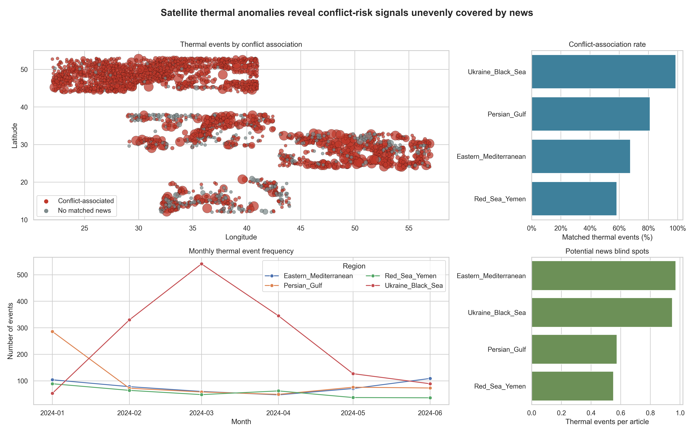

# CE49X Final Project Report

## Project Summary

This project builds a situation-monitoring pipeline for maritime shipping risk by combining NASA FIRMS satellite thermal anomalies with conflict-related news. The selected regions are Ukraine/Black Sea, Red Sea/Yemen, Persian Gulf/Hormuz, and the Eastern Mediterranean because they connect armed-conflict risk with shipping lanes, oil and gas supply, route insurance, and fuel-price volatility.

## Data Sources and Scope

- NASA FIRMS area API, VIIRS_SNPP_SP thermal anomaly detections.
- GDELT DOC 2.1 API, Google News RSS, and Bing News RSS for conflict-related articles.
- Date range: 2024-01-01 to 2024-06-30.
- Database: PostgreSQL in Docker, database `conflict_monitoring`.

## Database Tables

| table | rows |
| --- | --- |
| firms_detections | 265321 |
| news_articles | 3724 |
| thermal_events | 2904 |
| event_matches | 135311 |

## Regional Thermal Event and Coverage Summary

| region | thermal_events | mean_total_frp | median_total_frp | mean_duration_days | mean_detections | conflict_association_rate | conflict_associated_events | total_articles | unique_sources | mean_reporting_delay_days | median_reporting_delay_days | articles_per_thermal_event | satellite_value_score |
| --- | --- | --- | --- | --- | --- | --- | --- | --- | --- | --- | --- | --- | --- |
| Ukraine_Black_Sea | 1485 | 163.822 | 9.880 | 29.867 | 26.412 | 0.987 | 1466 | 1565 | 248 | 41.332 | 31.000 | 1.054 | 0.948 |
| Persian_Gulf | 614 | 1494.059 | 13.400 | 72.212 | 279.572 | 0.811 | 498 | 1068 | 670 | 61.585 | 65.000 | 1.739 | 0.574 |
| Eastern_Mediterranean | 469 | 251.116 | 10.860 | 48.158 | 47.539 | 0.676 | 317 | 482 | 287 | 100.663 | 117.000 | 1.028 | 0.971 |
| Red_Sea_Yemen | 336 | 773.205 | 8.640 | 37.354 | 95.673 | 0.583 | 196 | 609 | 385 | 55.911 | 46.000 | 1.812 | 0.551 |

## Hypothesis Test

The statistical test compares total FRP between conflict-associated and non-conflict thermal events.

| test | metric | group_1 | group_1_n | group_1_mean | group_2 | group_2_n | group_2_mean | t_statistic | p_value |
| --- | --- | --- | --- | --- | --- | --- | --- | --- | --- |
| Welch t-test | total_frp | conflict_associated | 2477 | 618.630 | not_conflict_associated | 427 | 13.708 | 2.314 | 0.021 |

## Machine Learning Results

| model | accuracy | precision | recall | f1 | test_rows |
| --- | --- | --- | --- | --- | --- |
| SVM | 0.917 | 0.981 | 0.921 | 0.950 | 581 |
| Decision Tree | 0.883 | 0.989 | 0.873 | 0.927 | 581 |
| Logistic Regression | 0.866 | 0.984 | 0.857 | 0.916 | 581 |
| Gaussian Naive Bayes | 0.811 | 0.995 | 0.782 | 0.876 | 581 |

## Key Findings

The pipeline processed 265,321 cleaned FIRMS detections and clustered them into 2,904 thermal events. The strongest news-linked signal by conflict-association rate was observed in Ukraine_Black_Sea, with an association rate of 98.7%. The highest average thermal intensity was observed in Persian_Gulf, where mean total FRP reached 1494.1 MW per clustered event. The results support the idea that satellite thermal anomalies can act as useful early-warning signals, but they work best when interpreted alongside news and regional context.

## Shipping and Energy Implications

For a maritime shipping company, the highest-risk regions are those where thermal activity, conflict-news association, and strategic shipping or energy geography overlap. The Black Sea affects grain and energy-linked trade, the Red Sea/Yemen area affects Bab el-Mandeb and Suez-linked routing, the Persian Gulf is directly tied to oil export risk, and the Eastern Mediterranean connects conflict risk with port operations and regional energy infrastructure. A practical monitoring system should flag sudden monthly spikes in thermal events, unusually high FRP clusters, and increases in conflict-associated thermal events as triggers for route review, insurance reassessment, and fuel hedging discussions.

## Limitations and Future Work

The analysis cannot prove that a thermal anomaly was caused by conflict. FIRMS also detects natural fires, agricultural burning, industrial flares, and accidental explosions. The news-matching strategy uses region labels, keywords, and a temporal window, so it may miss articles with vague geography or match events that are only loosely related. News coverage is also uneven: regions with fewer articles can look less conflict-associated even when risk is high. Future work should add ACLED or verified incident datasets, AIS vessel tracks, port disruption data, oil-price movements, better geocoding of article locations, and manual validation labels for a stronger classifier.

## Methodology Reflection

The hardest part of the pipeline was linking satellite detections to news in a defensible way. Satellite data is dense and quantitative, while news is sparse, biased, and text-based. If starting over, I would build a stronger geocoding layer, validate a sample of event-news matches by hand, and extend the observation window beyond six months to separate seasonal fire patterns from conflict-related thermal signatures more confidently.

## Dashboard

